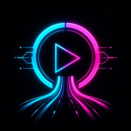
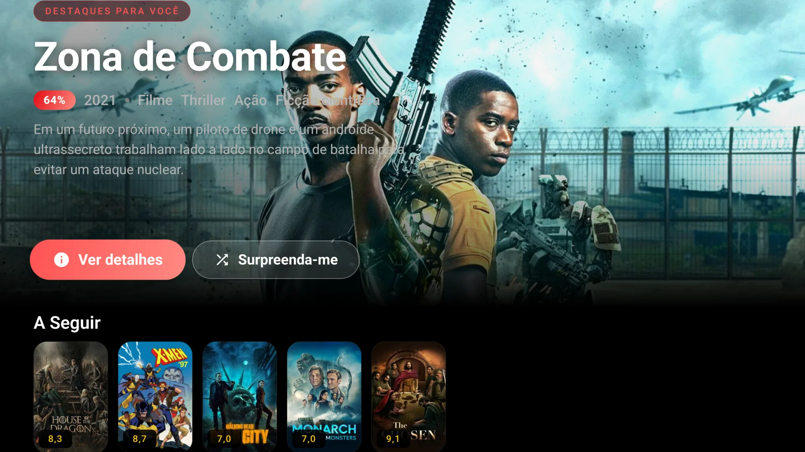
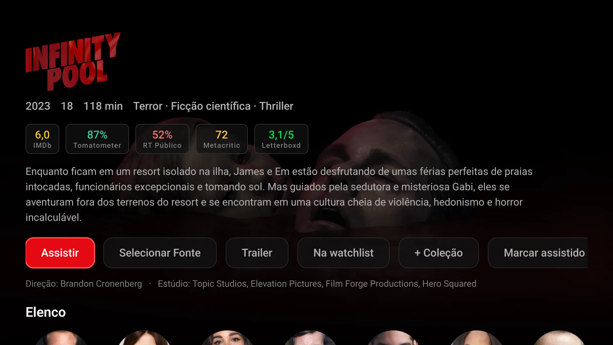
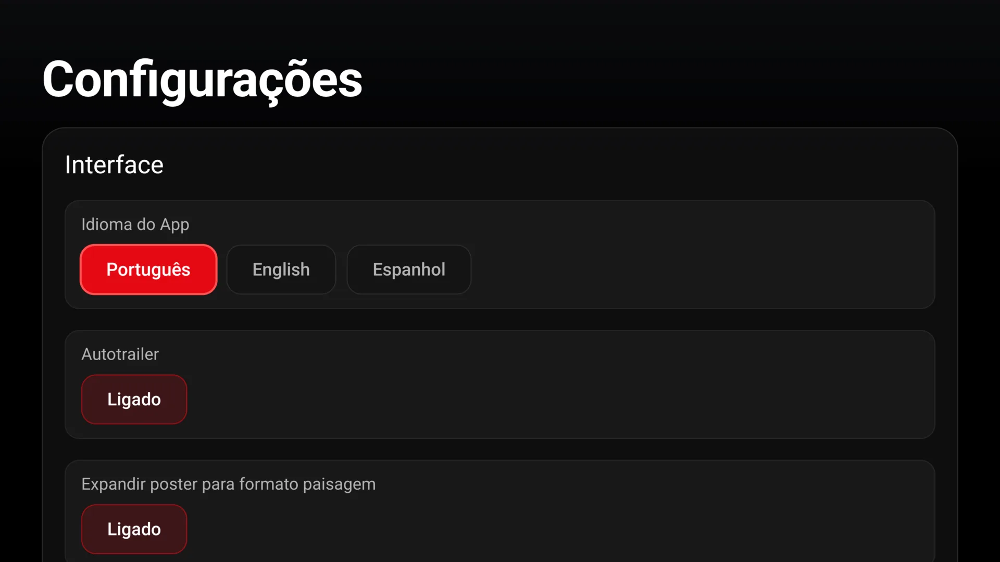

<p align="center">
  
</p>

<h1 align="center">OmniStream</h1>

<p align="center">
  <strong>Seu conteúdo, com uma experiência feita para a tela grande.</strong><br>
  Um cliente de mídia nativo, rápido e open source para Android TV.
</p>

<p align="center">
  
  
  
  <a href="LICENSE"></a>
</p>

<p align="center">
  <a href="https://github.com/sauliiin/open-Stremio/releases/latest"><strong>Baixar a versão mais recente</strong></a>
  &nbsp;·&nbsp;
  <a href="#compilar">Compilar</a>
  &nbsp;·&nbsp;
  <a href="android-native/README.md">Documentação técnica</a>
</p>

## Visão geral

<p align="center">
  
</p>

<p align="center"><sub>Uma Home cinematográfica, com Spotlight, backdrop em destaque e navegação pensada para o controle remoto.</sub></p>

<table>
  <tr>
    <td width="50%"></td>
    <td width="50%"></td>
  </tr>
  <tr>
    <td align="center"><sub>Detalhes ricos, avaliações e ações em um só lugar.</sub></td>
    <td align="center"><sub>Preferências claras para adaptar toda a experiência.</sub></td>
  </tr>
</table>

## O que torna o OmniStream diferente

- **Interface TV-first:** navegação fluida por D-pad, foco bem definido e múltiplos temas.
- **Home cinematográfica:** Spotlight, backdrops amplos, autotrailer e cards que podem se expandir de pôster para paisagem.
- **Reprodução nativa:** Media3/ExoPlayer com HLS, DASH, seleção de áudio e legendas.
- **Fontes inteligentes:** consulta addons compatíveis com o protocolo Stremio e tenta alternativas automaticamente.
- **Biblioteca conectada:** listas, watchlist, coleção, progresso e sincronização com MDBList ou Trakt.
- **Rápido mesmo ao abrir:** cache persistente em Room e atualização de dados em segundo plano.

> [!NOTE]
> O OmniStream é um cliente de mídia e não fornece conteúdo. Instale e use apenas addons e fontes aos quais você tenha direito de acesso.

## Instalação

Baixe o APK na página de [releases](https://github.com/sauliiin/open-Stremio/releases/latest) e faça o sideload em um dispositivo com **Android TV 7.0 ou superior**.

### Compilar

O projeto Gradle do app de TV está em [`android-native/`](android-native/). É necessário ter **JDK 17+** e o **Android SDK** configurados; o `local.properties` não é versionado e deve apontar para o SDK da sua máquina.

```bash
cd android-native
./gradlew assembleDebug
./gradlew assembleRelease
./gradlew installDebug
```

Os APKs por ABI são gerados em `android-native/app/build/outputs/apk/`. Para arquitetura, decisões do player, cache e modelo de addons, consulte a [documentação técnica](android-native/README.md).

## Tecnologia

`Kotlin` · `Jetpack Compose for TV` · `Media3 / ExoPlayer` · `Room` · `Retrofit / OkHttp` · `WorkManager` · `Firebase`

## Projetos relacionados

O [open-stremio-mobile](https://github.com/sauliiin/open-stremio-mobile) leva o mesmo núcleo para celulares com uma interface própria para toque. Os módulos compartilhados não são idênticos: recursos comuns precisam ser mantidos nos dois projetos de forma coordenada.

<details>
<summary><strong>Estrutura do repositório e projeto legado</strong></summary>

```text
android-native/   App nativo para Android TV
android/          Wrapper Capacitor legado
```

`android/`, `capacitor.config.ts`, `package.json` e `database.rules.json` são remanescentes de quando este repositório empacotava o site Angular [mdblist-hub](https://github.com/sauliiin/mdblist-hub) como WebView. Eles não participam do build do app nativo. O `database.rules.json` continua sendo usado pelas regras privadas do Realtime Database.

</details>

## Licença

Distribuído sob a licença **GPL-3.0**. Consulte [LICENSE](LICENSE).

O APK inclui `android-native/player/libs/media3-decoder-ffmpeg-1.11.0.aar`, uma build local do `decoder_ffmpeg` do Media3. O FFmpeg incorporado é LGPL/GPL, e suas obrigações de licença acompanham qualquer redistribuição do APK.
